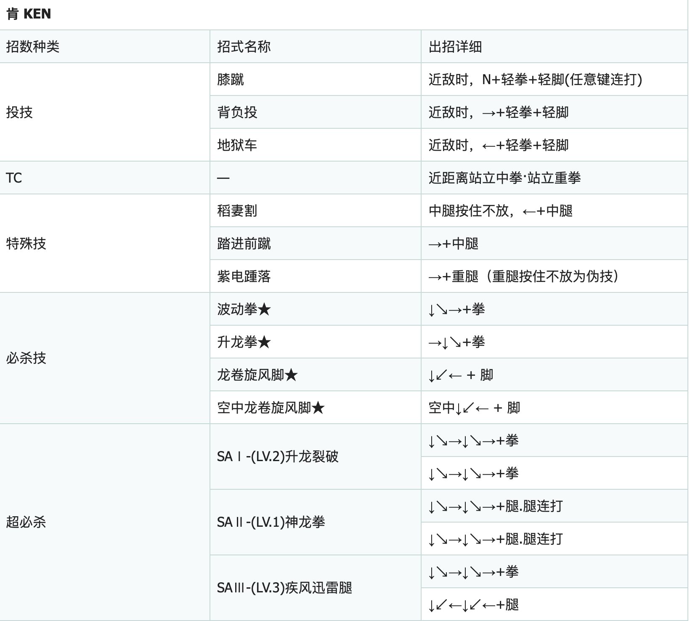

# Reinforcemen Learning for Street Fighter III: 3rd Strike
In this project, we use the Macro-based Reinforcement Learning algorithm to challenge the Street Fighter 3 game. We combine the important reinforcement learning algorithms such as PPO, A2C, NoisyNet, etc., and have achieved good results, through the 5th level of the game(difficulty = 7 = Highest Difficulty).

## Prerequisites
- PyTorch==1.5
- MAMEToolkit==1.1.0
- gym
- tensorboard
- numpy
- xvfb

## Install MAMEToolkit
If you run the code on a device without a display, xvfb must be installed.

```
pip install MAMEToolkit==1.1.0
sudo apt-get install xvfb
```

## Train
We start 8 processes at the same time to obtain game data, and then use a 8-layer convolutional network and GRU learning strategy.

```
python train.py
tensorboard --logdir log --host 0.0.0.0
```

## Test
When testing the code, the program will automatically record the game and output to `env1.mp4`.

```
python eval.py
```

## Macro
